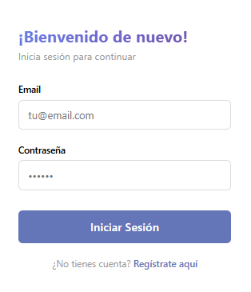
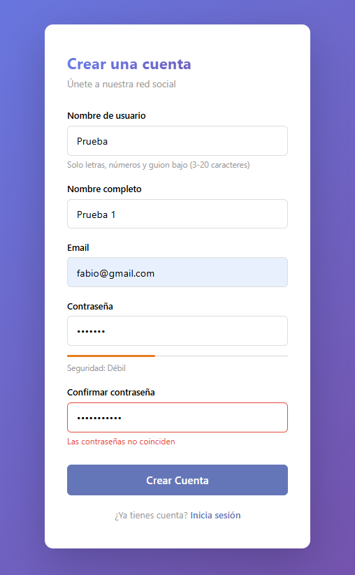
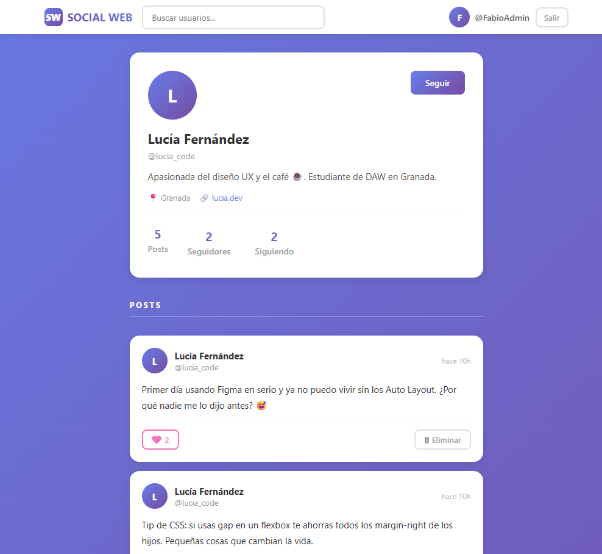

<div align="center">

# 🌐 Social Web — Red Social

### Trabajo de Fin de Grado · DAM 2025/2026

**Una red social completa construida desde cero con Spring Boot, PostgreSQL, JWT, Cloudinary y JavaScript Vanilla**

[](https://www.oracle.com/java/)
[](https://spring.io/projects/spring-boot)
[](https://www.postgresql.org/)
[](https://jwt.io/)
[](https://cloudinary.com/)
[](https://developer.mozilla.org/es/docs/Web/JavaScript)

</div>

---

## 📋 Tabla de contenidos

1. [Sobre el proyecto](#-sobre-el-proyecto)
2. [Funcionalidades](#-funcionalidades)
3. [Tecnologías](#-tecnologías)
4. [Arquitectura](#-arquitectura)
5. [Capturas de pantalla](#-capturas-de-pantalla)
6. [Estructura del proyecto](#-estructura-del-proyecto)
7. [Puesta en marcha](#-puesta-en-marcha)
8. [Endpoints de la API](#-endpoints-de-la-api)
9. [Modelo de datos](#-modelo-de-datos)
10. [Tests](#-tests)
11. [Autor](#-autor)

---

## 📌 Sobre el proyecto

**Social Web** es una red social web desarrollada como Trabajo de Fin de Grado del ciclo formativo de **Desarrollo de Aplicaciones Multiplataforma (DAM)**. El objetivo del proyecto era construir una aplicación full-stack funcional aplicando todos los conocimientos adquiridos durante el ciclo: diseño de base de datos relacional, API REST con autenticación JWT, lógica de negocio en capas y un frontend dinámico sin frameworks.

El proyecto está completamente operativo e incluye registro y login de usuarios, publicación de posts con imágenes, sistema de likes, perfiles editables, seguimiento entre usuarios, scroll infinito y roles de administrador.

---

## ✨ Funcionalidades

| Módulo | Funcionalidad |
|--------|--------------|
| **Autenticación** | Registro con validación, login con JWT, protección de rutas |
| **Feed** | Feed global paginado, scroll infinito, publicación con imagen adjunta |
| **Posts** | Crear post (texto + imagen opcional), eliminar propio post, likes con toggle |
| **Perfiles** | Ver perfil público, editar perfil propio (bio, ubicación, web, foto), avatar generado |
| **Seguimiento** | Seguir / dejar de seguir usuarios, ver lista de seguidores y seguidos |
| **Búsqueda** | Buscador de usuarios en tiempo real con debounce |
| **Administración** | Rol ADMIN con capacidad de eliminar cualquier post |
| **Imágenes** | Subida a Cloudinary, validación de tamaño (máx. 10 MB), lightbox integrado |
| **Seguridad** | Filtro JWT personalizado, BCrypt, gestión de errores HTTP 401/403 |
| **Tests** | Tests de integración para autenticación y posts contra BD real |

---

## 🛠️ Tecnologías

### Backend
- **Java 17** + **Spring Boot 3.4.5**
- **Spring Security** — autenticación y autorización
- **Spring Data JPA** + **Hibernate** — acceso a datos con ORM
- **JJWT 0.11.5** — generación y validación de tokens JWT
- **Cloudinary SDK** — almacenamiento de imágenes en la nube
- **Lombok** — reducción de boilerplate
- **Bean Validation** — validación de datos de entrada
- **Maven** — gestión de dependencias y build

### Frontend
- **HTML5** + **CSS3** + **JavaScript Vanilla** — sin frameworks
- **Fetch API** — comunicación asíncrona con el backend
- **IntersectionObserver API** — scroll infinito
- **FileReader API** — preview de imágenes antes de subir
- **localStorage** — persistencia del token y datos del usuario

### Base de datos
- **PostgreSQL 16** — motor relacional principal
- **Script SQL** — esquema versionado incluido en el repositorio

### Herramientas de desarrollo
- **Spring Initializr** — scaffolding del proyecto
- **Postman** — pruebas manuales de la API
- **draw.io** — diagramas UML y de casos de uso
- **PgAdmin** — administración de la base de datos

---

## 🏗️ Arquitectura

El proyecto sigue una arquitectura **cliente-servidor** con separación clara de responsabilidades:

<div align="center">
  
  <br/>
  <em>Diagrama de arquitectura: Frontend → Spring Boot (Controllers → Services → Repositories → Models) → PostgreSQL</em>
</div>

<br/>

El backend implementa el **patrón MVC** en capas:

```
Petición HTTP
    │
    ▼
JwtAuthenticationFilter   ← valida el token en cada petición
    │
    ▼
Controller (REST API)     ← recibe la petición y delega
    │
    ▼
Service (lógica negocio)  ← reglas de negocio, validaciones
    │
    ▼
Repository (Spring JPA)   ← consultas a la base de datos
    │
    ▼
PostgreSQL                ← persistencia de datos
```

### Flujo de autenticación JWT

```
1. Cliente envía POST /api/auth/login  { email, password }
2. Spring Security verifica credenciales con BCrypt
3. Backend genera token JWT (válido 24h) y lo devuelve
4. Cliente guarda el token en localStorage
5. Cada petición posterior incluye: Authorization: Bearer <token>
6. JwtAuthenticationFilter valida el token y registra al usuario
   en el SecurityContext de Spring para ese hilo de petición
```

### Diagrama de casos de uso

<div align="center">
  
  <br/>
  <em>Casos de uso: Usuario anónimo (registro/login) vs. Usuario registrado vs. Administrador</em>
</div>

---

## 📸 Capturas de pantalla

### Login
<div align="center">
  
</div>

> Formulario de inicio de sesión con validación en tiempo real. Si el token ya existe en localStorage, redirige directamente al feed.

---

### Registro
<div align="center">
  
</div>

> Registro con validaciones: indicador de seguridad de contraseña, comprobación de que las contraseñas coinciden y feedback visual por campo.

---

### Feed principal
<div align="center">
  
</div>

> Feed global con scroll infinito (20 posts por página). Compositor de posts con adjunto de imagen, contador de caracteres y likes optimistas.

---

### Perfil de usuario
<div align="center">
  
</div>

> Página de perfil con estadísticas (posts, seguidores, seguidos), posts propios y botón de seguir/dejar de seguir.

---

### Modal de edición de perfil
<div align="center">
  
</div>

> Modal para editar nombre, biografía, ubicación y sitio web. Disponible únicamente para el usuario propietario del perfil.

---

### Lista de seguidores
<div align="center">
  
</div>

> Modal con la lista de seguidores o seguidos de un perfil, con navegación directa a cada uno.

---

## 📁 Estructura del proyecto

```
PROYECTO FINAL DE GRADO/
│
├── 1 - BBDD/
│   ├── database_schema_postgresql.sql          # Esquema de desarrollo
│   └── production_database_schema_postgresql.sql
│
├── 2 - FRONTEND/
│   ├── login.html
│   ├── register.html
│   ├── feed.html
│   ├── profile.html
│   ├── css/
│   │   ├── login.css
│   │   ├── register.css
│   │   ├── feed.css
│   │   └── profile.css
│   └── js/
│       ├── login.js
│       ├── register.js
│       ├── feed.js
│       └── profile.js
│
└── 3 - BACKEND/tfg_redsocial/
    └── src/main/java/com/tfg/tfg_redsocial/
        ├── controllers/
        │   ├── AuthController.java
        │   ├── PostController.java
        │   ├── ProfileController.java
        │   └── FollowController.java
        ├── services/
        │   ├── AuthService.java
        │   ├── PostService.java
        │   ├── ProfileService.java
        │   ├── FollowService.java
        │   └── CloudinaryService.java
        ├── repositories/
        │   ├── UserRepository.java
        │   ├── PostRepository.java
        │   ├── ProfileRepository.java
        │   ├── LikeRepository.java
        │   └── FollowRepository.java
        ├── models/
        │   ├── User.java
        │   ├── Profile.java
        │   ├── Post.java
        │   ├── Like.java
        │   ├── Follow.java
        │   └── Role.java (enum: USER, ADMIN)
        ├── dtos/
        │   ├── LoginRequest.java
        │   ├── RegisterRequest.java
        │   ├── AuthResponse.java
        │   ├── PostRequest.java / PostResponse.java
        │   ├── ProfileResponse.java
        │   └── UpdateProfileRequest.java
        ├── security/
        │   ├── SecurityConfig.java
        │   ├── JwtAuthenticationFilter.java
        │   └── JwtUtil.java
        └── exception/
            ├── GlobalExceptionHandler.java
            └── ResourceNotFoundException.java
```

---

## 🚀 Puesta en marcha

### Prerrequisitos

- **Java 17** o superior
- **Maven 3.8+**
- **PostgreSQL 14+** corriendo en `localhost:5432`
- La configuración de **Cloudinary** incluida en el proyecto (no es necesario crear otra cuenta para probarlo)

### 1. Clonar el repositorio

```bash
git clone https://github.com/FabioCuffaro/Tfg_Dam.git
cd social-web-tfg
```

### 2. Crear y preparar la base de datos

Abrir el archivo `1 - BBDD/main_database_schema_postgresql.sql` y seguir las
**INSTRUCCIONES DE USO** que aparecen al principio. El propio script indica qué
bloques deben ejecutarse en desarrollo local y cuáles corresponden a producción
en Railway.

> **Importante:** en local, primero se ejecuta el bloque `CREATE DATABASE`, después
> se selecciona la base de datos `social_tfg_db` y finalmente se ejecutan las tablas.
> Los datos de prueba son opcionales. No ejecutes el bloque de creación de la base
> de datos en Railway, porque Railway ya la crea automáticamente.

### 3. Configurar el backend

Editar `3 - BACKEND/tfg_redsocial/src/main/resources/application.properties`:

```properties
# Base de datos
spring.datasource.url=jdbc:postgresql://localhost:5432/social_tfg_db
spring.datasource.username=TU_USUARIO
spring.datasource.password=TU_CONTRASEÑA

# JWT (cambiar en producción)
jwt.secret=tu-clave-secreta-larga-minimo-256-bits
jwt.expiration=86400000

# Cloudinary
# Para probar el proyecto, conservar los valores que ya incluye application.properties
cloudinary.cloud-name=VALOR_YA_CONFIGURADO
cloudinary.api-key=VALOR_YA_CONFIGURADO
cloudinary.api-secret=VALOR_YA_CONFIGURADO
```

> **Cloudinary para las pruebas:** no cambies ni elimines las claves de Cloudinary
> que ya están configuradas en `application.properties`. Se incluyen para que la
> subida de imágenes funcione al probar el proyecto sin configurar una cuenta propia.
> Solo debes sustituirlas si vas a desplegar tu propia instancia con otra cuenta.

### 4. Arrancar el backend

```bash
cd "3 - BACKEND/tfg_redsocial"
./mvnw spring-boot:run
```

El servidor arranca en `http://localhost:8080`.

### 5. Abrir el frontend

Sirve la carpeta `2 - FRONTEND/` con cualquier servidor estático. La opción más sencilla con VS Code es la extensión **Live Server** (clic derecho → _Open with Live Server_ sobre `login.html`).

> **Importante:** el `API_URL` en cada archivo `.js` apunta a `http://localhost:8080`. Cámbialo si despliegas el backend en otro host.

---

## 📡 Endpoints de la API

### Autenticación — `/api/auth`

| Método | Ruta | Descripción | Auth |
|--------|------|-------------|------|
| `POST` | `/api/auth/register` | Registrar nuevo usuario | ❌ Pública |
| `POST` | `/api/auth/login` | Iniciar sesión, devuelve JWT | ❌ Pública |

### Posts — `/api/posts`

| Método | Ruta | Descripción | Auth |
|--------|------|-------------|------|
| `GET` | `/api/posts?page=0` | Feed global paginado (20/pág.) | ✅ JWT |
| `GET` | `/api/posts/user/{userId}?page=0` | Posts de un usuario | ✅ JWT |
| `POST` | `/api/posts` | Crear post (multipart/form-data) | ✅ JWT |
| `DELETE` | `/api/posts/{id}` | Eliminar post (autor o ADMIN) | ✅ JWT |
| `POST` | `/api/posts/{id}/like` | Toggle like/unlike | ✅ JWT |

### Perfiles — `/api/profiles`

| Método | Ruta | Descripción | Auth |
|--------|------|-------------|------|
| `GET` | `/api/profiles/{username}` | Ver perfil por username | ✅ JWT |
| `PUT` | `/api/profiles/{username}` | Editar perfil propio | ✅ JWT |
| `GET` | `/api/profiles/search?q=` | Buscar usuarios | ✅ JWT |

### Seguimiento — `/api/follows`

| Método | Ruta | Descripción | Auth |
|--------|------|-------------|------|
| `POST` | `/api/follows/{username}` | Seguir usuario | ✅ JWT |
| `DELETE` | `/api/follows/{username}` | Dejar de seguir | ✅ JWT |
| `GET` | `/api/follows/{username}/followers` | Lista de seguidores | ✅ JWT |
| `GET` | `/api/follows/{username}/following` | Lista de seguidos | ✅ JWT |

---

## 🗃️ Modelo de datos

### Diagrama UML de entidades

<div align="center">
  
</div>

### Modelo relacional

<div align="center">
  
</div>

### Tablas principales

| Tabla | Descripción |
|-------|-------------|
| `users` | Credenciales de acceso (email, password BCrypt, rol) |
| `profiles` | Datos públicos del usuario (username, bio, avatar, ubicación…) |
| `posts` | Publicaciones (content, image_url, created_at) |
| `likes` | Relación N:M entre usuarios y posts |
| `follows` | Relación N:M entre usuarios (follower → following) |

---

## 🧪 Tests

El proyecto incluye **tests de integración** que prueban los endpoints contra una base de datos PostgreSQL real (no mocks).

```bash
cd "3 - BACKEND/tfg_redsocial"
./mvnw test
```

> **Requisito:** PostgreSQL debe estar arrancado en `localhost:5432/social_tfg_db` con los datos de conexión configurados en `application.properties`.

Los tests cubren:

- `AuthControllerTest` — registro, login con credenciales correctas e incorrectas, token JWT
- `PostControllerTest` — crear post, feed paginado, like/unlike, eliminar post
- `SecurityTest` — acceso a rutas protegidas sin token, rechazo de tokens inválidos

---

## 👨‍💻 Autor

**`Fabio Cuffaro Cámara`** <br><br>
Estudiante de DAM — Trabajo de Fin de Grado 2025/2026 <br>
A programar se aprende programando 🧑🏻‍💻🚀

---

<div align="center">
  <sub>Proyecto académico desarrollado como TFG del ciclo de Desarrollo de Aplicaciones Multiplataforma</sub>
</div>
